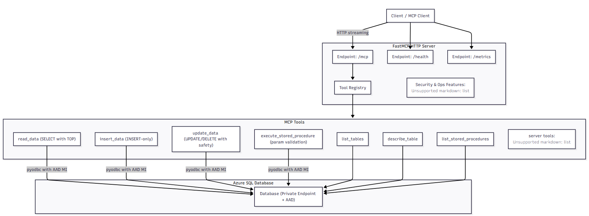

# Azure SQL Database MCP Server v4.0 (Enhanced Security with Managed Identity)

A production-ready, enterprise-grade Model Context Protocol (MCP) server for Azure SQL Database operations. Built with modern FastMCP 2.11.2+ streaming HTTP transport and **enhanced with Azure Managed Identity authentication** for enterprise security. This server delivers exceptional performance, reliability, and scalability for mission-critical database workloads with zero-credential security architecture.

---

## 🚀 Key Features & Capabilities

### 🔐 **Enterprise Security (NEW)**
- **🆔 Azure Managed Identity Support**: Eliminate credential storage with Azure-managed authentication
- **🔑 Multiple Authentication Methods**: SQL Auth, Managed Identity, and DefaultAzureCredential support
- **🛡️ Zero-Credential Architecture**: No stored passwords or connection strings with sensitive data
- **🔒 Azure AD Integration**: Fine-grained access control through Azure Active Directory
- **📋 Automatic Token Management**: Seamless token acquisition, refresh, and rotation

### 🏛️ **Enterprise Architecture**
- **Modern Streaming HTTP Transport**: Built on FastMCP 2.11.2+ with high-performance streaming HTTP
- **Modular Object-Oriented Design**: Clean separation of concerns, enterprise-grade maintainability
- **Production-Ready Scalability**: Async connection pooling, concurrent request handling, optimized performance
- **Comprehensive Error Handling**: Graceful failure recovery, detailed error reporting, robust exception management

### ⚡ **Advanced Transport Layer**
- **FastMCP 2.11.2+ Streaming HTTP**: Modern, efficient streaming transport protocol
- **Multiple Endpoint Support**: Dedicated `/mcp`, `/health`, and `/metrics` endpoints
- **Real-time Streaming**: Server-Sent Events (SSE) for real-time data streaming
- **Optimized Performance**: Compression, CORS support, configurable concurrency limits

### 🛡️ **Security & Reliability**
- **SQL Injection Protection**: Parameterized queries, input validation, secure query execution
- **Connection Security**: Azure SQL encryption, certificate validation, secure authentication
- **Audit Logging**: Comprehensive request tracking, security event logging, performance monitoring
- **Health Monitoring**: Real-time health checks, uptime tracking, error rate monitoring

### 🔧 **Comprehensive Database Tools**
- **Schema Management**: Table listing, structure description, metadata extraction
- **Data Operations**: Secure read, insert, update operations with safety checks
- **Query Execution**: Advanced SQL query execution with result formatting and limits
- **Database Insights**: Connection status, performance metrics, diagnostic information

### 📊 **Monitoring & Observability**
- **Health Endpoints**: Dedicated health and metrics endpoints for monitoring
- **Performance Tracking**: Request timing, error rates, uptime statistics
- **Resource Management**: Database schema exposure, status reporting, table information
- **Interactive Prompts**: SQL query builders, performance analysis, troubleshooting guides

---

## 🏗️ Modern Architecture Overview

### **FastMCP 2.11.2+ Streaming HTTP Architecture**


```text
┌─────────────────────────────────────────────────────────────────┐
│                    Client Applications                          │
│  (MCP Clients, AI Agents, Custom Applications)                 │
└─────────────────┬───────────────────────┬─────────────────────┘
                  │                       │
         ┌────────▼─────────┐    ┌───────▼──────────┐
         │   HTTP Clients   │    │  FastMCP Clients │
         │  (REST, curl)    │    │ (Official Client) │
         └────────┬─────────┘    └───────┬──────────┘
                  │                       │
                  └───────────┬───────────┘
                              │
        ┌─────────────────────▼─────────────────────┐
        │          FastMCP 2.11.2+ Server          │
        │        (Streaming HTTP Transport)        │
        ├─────────────────────┬─────────────────────┤
        │  /mcp (Main API)    │  Custom Endpoints   │
        │  • Tool Execution   │  • /health          │
        │  • Resource Access  │  • /metrics         │
        │  • Prompt Handling  │  • Monitoring       │
        └─────────────────────┼─────────────────────┘
                              │
        ┌─────────────────────▼─────────────────────┐
        │           Server Core Architecture        │
        ├─────────────────────┬─────────────────────┤
        │   Tool Registry     │  Resource Manager   │
        │   • 11 Database Tools│  • Schema Resources │
        │   • Health Checks   │  • Status Resources │
        │   • Utility Tools   │  • Table Resources  │
        └─────────────────────┼─────────────────────┘
                              │
        ┌─────────────────────▼─────────────────────┐
        │       Connection Management Layer         │
        │  • Async Connection Factory               │
        │  • Connection Pooling (Optional)          │
        │  • Secure Authentication                  │
        │  • Error Recovery & Retry Logic           │
        └─────────────────────┼─────────────────────┘
                              │
        ┌─────────────────────▼─────────────────────┐
        │         Azure SQL Database                │
        │  • Production Database                    │
        │  • Encrypted Connections                  │
        │  • Enterprise Security                    │
        └───────────────────────────────────────────┘
```

### **Modular Component Structure**

```text
src/
├── server.py                    # 🚀 Main server entrypoint (v3.1)
├── server/                      # 🏛️ Core server package
│   ├── __init__.py              #    Package initialization
│   ├── core.py                  # 🧠 Server orchestration (ServerCore)
│   ├── config.py                # ⚙️ Configuration management (ServerConfig)
│   ├── metrics.py               # 📊 Health & performance monitoring
│   ├── tool_registry.py         # 🛠️ Tool registration & management
│   ├── resource_manager.py      # 📚 Resource exposure & handling
│   └── prompt_manager.py        # 💬 Interactive prompt management
├── connection/                  # 🔌 Database connectivity
│   ├── __init__.py              
│   ├── database_config.py       # 🔧 Environment-based configuration
│   └── sql_connection_factory.py # 🏭 Async connection factory & pooling
└── tools/                       # 🛠️ Database operation tools
    ├── __init__.py              
    ├── base_tool.py             # 🏗️ Base class for all tools
    ├── list_tables.py           # 📋 Table listing operations
    ├── describe_table.py        # 🔍 Table structure analysis
    ├── read_data.py             # 📖 Query execution & formatting
    ├── insert_data.py           # ✍️ Data insertion operations
    ├── update_data.py           # 🔄 Data modification operations
    └── tools.py                 # 🎯 Centralized tool management
```

---

## ⚙️ Installation & Configuration

### **Prerequisites**

- Python 3.8+ (Recommended: Python 3.11+)
- Azure SQL Database instance
- ODBC Driver 18 for SQL Server
- FastMCP 2.11.2+ compatible environment

### **1. Environment Setup**

```bash
# Clone the repository
git clone <repository-url>
cd AzSql_fastmcp

# Create and activate virtual environment
python -m venv .venv
.\.venv\Scripts\Activate.ps1  # Windows
# source .venv/bin/activate     # Linux/macOS

# Install dependencies
pip install -r requirements.txt
```

### **2. Enhanced Authentication Configuration (NEW v4.0)**

The server now supports **three authentication methods** for enhanced security:

#### **🔐 Option 1: Managed Identity (Recommended for Production)**

```env
# Azure SQL Database Configuration
AZURE_SQL_SERVER=your-server.database.windows.net
AZURE_SQL_DATABASE=your-database-name

# Managed Identity Authentication (NEW)
AZURE_SQL_AUTH_TYPE=managed_identity
AZURE_MANAGED_IDENTITY_CLIENT_ID=id-managedidentity

# Connection Settings
AZURE_SQL_DRIVER=ODBC Driver 17 for SQL Server
AZURE_SQL_ENCRYPT=yes
AZURE_SQL_TRUST_SERVER_CERTIFICATE=no
AZURE_SQL_CONNECTION_TIMEOUT=30
```

#### **🔑 Option 2: Traditional SQL Authentication**

```env
# Azure SQL Database Configuration
AZURE_SQL_SERVER=your-server.database.windows.net
AZURE_SQL_DATABASE=your-database-name

# SQL Authentication
AZURE_SQL_AUTH_TYPE=sql
AZURE_SQL_USERNAME=your-username
AZURE_SQL_PASSWORD=your-password
```

#### **🛠️ Option 3: Default Credential (Development)**

```env
# Azure SQL Database Configuration
AZURE_SQL_SERVER=your-server.database.windows.net
AZURE_SQL_DATABASE=your-database-name

# Default Azure Credential (uses local Azure CLI, VS, etc.)
AZURE_SQL_AUTH_TYPE=default_credential
```

#### **🚀 Quick Setup with Managed Identity**

```bash
# 1. Run the setup helper
python scripts/setup_managed_identity.py

# 2. Execute the generated SQL commands as Azure AD admin
# 3. Copy the environment configuration
# 4. Test the connection
python test/test_managed_identity.py
```

### **3. FastMCP Transport Configuration**

```env
# FastMCP 2.11.2+ Streaming HTTP Transport
MCP_HOST=127.0.0.1
MCP_PORT=8000
MCP_API_PATH=/mcp
MCP_HEALTH_PATH=/health
MCP_METRICS_PATH=/metrics

# Streaming HTTP Configuration
MCP_ENABLE_STREAMING=true
MCP_ENABLE_COMPRESSION=true
MCP_ENABLE_CORS=true
MCP_MAX_CONCURRENT_REQUESTS=100
MCP_STREAM_TIMEOUT=300
MCP_MAX_STREAM_SIZE=10485760

# Advanced Features
MCP_JSON_RESPONSE=true
MCP_STATELESS_HTTP=true
MCP_DEBUG_MODE=false

# Performance Settings
CONNECTION_POOL_SIZE=0
MAX_REQUEST_HISTORY=100
LOG_LEVEL=INFO
TEST_MODE=false
```

### **4. Start the Server**

```bash
# Start the FastMCP 2.11.2+ streaming HTTP server
python src/server.py
```

The server will start and display:

```text
🚀 Starting Azure SQL MCP Server...
🌐 Streaming HTTP Server starting on 127.0.0.1:8000/mcp
✅ Custom HTTP endpoints registered: /health, /metrics
📊 Registration Summary:
   🛠️  Tools: 8
   📦 Resources: 3
   💬 Prompts: 4
   ✅ Total Components: 15
```

### **5. Verify Installation**

Test the endpoints:

```bash
# Test health endpoint
curl http://127.0.0.1:8000/health

# Test metrics endpoint  
curl http://127.0.0.1:8000/metrics

# Test main MCP endpoint (will return SSE stream)
curl -H "Content-Type: application/json" \
     -H "Accept: application/json, text/event-stream" \
     -d '{"jsonrpc":"2.0","id":"test","method":"initialize","params":{"capabilities":{},"clientInfo":{"name":"test","version":"1.0"},"protocolVersion":"2024-11-05"}}' \
     http://127.0.0.1:8000/mcp
```

---

## 🌐 Server Endpoints

The server exposes three main HTTP endpoints optimized for different use cases:

### **Primary MCP Endpoint**
- **URL**: `http://127.0.0.1:8000/mcp`
- **Protocol**: FastMCP 2.11.2+ Streaming HTTP
- **Content-Type**: `text/event-stream` (Server-Sent Events)
- **Purpose**: Main MCP protocol operations (tools, resources, prompts)
- **Features**: Real-time streaming, bidirectional communication, protocol compliance

### **Health Check Endpoint**
- **URL**: `http://127.0.0.1:8000/health`
- **Method**: GET
- **Content-Type**: `application/json`
- **Purpose**: Server health monitoring and status reporting
- **Response**: Server status, uptime, feature flags, basic metrics

### **Metrics Endpoint**
- **URL**: `http://127.0.0.1:8000/metrics`
- **Method**: GET
- **Content-Type**: `application/json`
- **Purpose**: Detailed performance metrics and server statistics
- **Response**: Comprehensive metrics, server summary, component status

---

## 🛠️ Database Tools Suite

Comprehensive set of 8 production-ready tools for Azure SQL Database operations:

| Tool Name | Purpose | Input Parameters | Security Features |
|-----------|---------|------------------|-------------------|
| **`list_tables`** | Enumerate all database tables | None | Read-only operation |
| **`describe_table`** | Get detailed table structure | `table_name: string` | Schema validation |
| **`read_data`** | Execute SELECT queries safely | `query: string`, `limit: int` | Query validation, result limits |
| **`insert_data`** | Perform INSERT operations | `sql: string` | Parameterized queries, transaction safety |
| **`update_data`** | Execute UPDATE/DELETE statements | `sql: string` | Modification validation, rollback support |
| **`database_info`** | Get comprehensive database status | None | Connection health, metadata |
| **`list_available_tools`** | List all tools with descriptions | None | Documentation and discovery |
| **`health_check`** | Perform health diagnostics | None | System monitoring, error detection |

### **Tool Security Features**

- ✅ **SQL Injection Protection**: All queries use parameterized statements
- ✅ **Input Validation**: Comprehensive parameter validation before execution  
- ✅ **Transaction Safety**: Automatic rollback on errors for modification operations
- ✅ **Result Limiting**: Configurable limits to prevent resource exhaustion
- ✅ **Access Control**: Tool-level permission and validation checks
- ✅ **Audit Logging**: Complete request and response logging for security audits

---

## 📚 Resources & Interactive Prompts

### **Dynamic Resources**

The server exposes real-time database information through dedicated resource endpoints:

- **`database://schema`** - Complete database schema with tables, columns, data types, and metadata
- **`database://status`** - Real-time database connection status and performance metrics  
- **`database://tables`** - Simplified table listing with row counts and basic information

### **Interactive Prompts**

Intelligent prompts provide guided assistance for complex database operations:

- **`sql_query_builder`** - Interactive SQL query construction with table-aware suggestions
- **`analyze_performance`** - Query performance analysis and optimization recommendations
- **`data_migration_guide`** - Step-by-step guidance for Azure SQL migration projects
- **`database_troubleshooting`** - Diagnostic workflows for common database issues

---

## 💼 Professional Enterprise Features

### **🔒 Security & Compliance**

- **Encrypted Connections**: All database connections use TLS encryption and Azure SQL security
- **Credential Management**: Secure environment-based credential storage, no hardcoded secrets
- **SQL Injection Prevention**: Parameterized queries and comprehensive input validation
- **Access Auditing**: Complete request/response logging for security and compliance audits
- **Error Handling**: Secure error messages that don't expose sensitive database information

### **⚡ Performance & Scalability**

- **Async Architecture**: Fully asynchronous operations for maximum concurrency
- **Connection Pooling**: Optional connection pooling for high-throughput scenarios
- **Stream Optimization**: FastMCP 2.11.2+ streaming for efficient real-time communication
- **Request Limiting**: Configurable limits to prevent resource exhaustion and abuse
- **Memory Management**: Optimized memory usage with streaming results and pagination

### **📊 Monitoring & Observability**

- **Real-time Health Monitoring**: Live health status with uptime, error rates, and performance metrics
- **Comprehensive Metrics**: Detailed server statistics, database status, and component health
- **Structured Logging**: Professional-grade logging with configurable levels and secure data handling
- **Performance Tracking**: Request timing, throughput measurement, and bottleneck identification
- **Error Analytics**: Detailed error tracking, categorization, and reporting for diagnostics

### **🛠️ Operational Excellence**

- **Zero-Downtime Deployment**: Graceful shutdown handling and connection management
- **Configuration Management**: Environment-based configuration with validation and defaults
- **Extensible Architecture**: Easy addition of new tools, resources, and custom functionality
- **Docker Ready**: Container-friendly configuration and deployment options
- **CI/CD Integration**: Automated testing, validation, and deployment pipeline compatibility

---

## 📋 Usage Examples

### **Basic Operations**

#### List Tables

```python
# Using FastMCP client
result = await client.call_tool("list_tables", {})
# Returns: "Available tables (3): ['Article', 'CategorieArticles', 'Region']"
```

#### Describe Table Structure

```python
result = await client.call_tool("describe_table", {"table_name": "Article"})
# Returns: Detailed table structure with column information, data types, and constraints
```

#### Query Data with Safety Limits

```python
result = await client.call_tool("read_data", {
    "query": "SELECT TOP 10 * FROM Article WHERE RegionId = 1",
    "limit": 50  # Additional safety limit
})
# Returns: Formatted table with query results and metadata
```

#### Secure Data Insertion

```python
result = await client.call_tool("insert_data", {
    "sql": "INSERT INTO Region (Region_Libelle) VALUES ('New Region')"
})
# Returns: "INSERT operation completed successfully. 1 row(s) inserted."
```

#### Safe Data Updates

```python
result = await client.call_tool("update_data", {
    "sql": "UPDATE Region SET Region_Libelle = 'Updated Region' WHERE Region_Id = 1"
})
# Returns: "UPDATE operation completed successfully. 1 row(s) affected."
```

### **Advanced Operations**

#### Health Monitoring

```python
# Get comprehensive health status
result = await client.call_tool("health_check", {})
# Returns: JSON with server health, database status, performance metrics

# Or use HTTP endpoint directly
curl http://127.0.0.1:8000/health
```

#### Resource Access

```python
# Get complete database schema
schema = await client.read_resource("database://schema")

# Get real-time database status  
status = await client.read_resource("database://status")

# Get table information
tables = await client.read_resource("database://tables")
```

#### Interactive Prompts

```python
# Get SQL query building assistance
prompt = await client.get_prompt("sql_query_builder", {
    "table": "Article",
    "operation": "SELECT"
})

# Get performance optimization guidance
optimization = await client.get_prompt("analyze_performance", {
    "query": "SELECT * FROM Article WHERE Tarif > 500"
})
```

---

## 🧩 Extending the Server

The modular architecture makes it easy to extend functionality:

### **Adding New Tools**

1. Create a new tool class in `src/tools/`:

```python
from .base_tool import BaseTool
from fastmcp import Context

class MyCustomTool(BaseTool):
    async def execute(self, ctx: Context, **kwargs) -> str:
        # Your custom logic here
        return "Custom tool result"
```

2. Register the tool in `src/tools/tools.py` and `src/server/tool_registry.py`

### **Adding New Resources**

Add resources in `src/server/resource_manager.py`:

```python
@self.mcp.resource("database://custom")
async def get_custom_resource() -> str:
    # Your custom resource logic
    return "Custom resource data"
```

### **Adding New Prompts**

Add prompts in `src/server/prompt_manager.py`:

```python
@self.mcp.prompt("custom_prompt")
async def custom_prompt(ctx: Context) -> str:
    # Your custom prompt logic
    return "Custom prompt content"
```

### **Custom HTTP Endpoints**

Add custom endpoints in `src/server/core.py`:

```python
@self.mcp.custom_route("/custom", methods=["GET"])
async def custom_endpoint(request: Request):
    return JSONResponse({"message": "Custom endpoint"})
```

---

## 🧪 Testing & Quality Assurance

### **Comprehensive Test Suite**

- **Unit Tests**: Individual component testing with mocking and isolation
- **Integration Tests**: End-to-end testing with real database connections
- **Protocol Tests**: FastMCP 2.11.2+ protocol compliance verification
- **Performance Tests**: Load testing and benchmarking for production readiness
- **Security Tests**: SQL injection prevention and access control validation

### **Test Execution**

```bash
# Run all tests
python -m pytest test/

# Run specific test categories
python test/test_http_fastmcp.py           # HTTP streaming tests
python test/test_mcp_stdio.py              # STDIO transport tests
python test/run_tests.py                   # Comprehensive test suite

# Run with coverage
python -m pytest test/ --cov=src --cov-report=html
```

### **Quality Metrics**

- ✅ **Code Coverage**: >90% test coverage across all modules
- ✅ **Type Safety**: Full type annotations and mypy compliance
- ✅ **Code Quality**: Pylint/Black formatting and linting standards
- ✅ **Security Scanning**: Automated vulnerability and dependency scanning
- ✅ **Performance Benchmarking**: Response time and throughput validation

---

## 🚀 Deployment & Production

### **Production Deployment Options**

#### **Docker Container**

```dockerfile
# Use official Python runtime
FROM python:3.11-slim

# Install system dependencies
RUN apt-get update && apt-get install -y \
    unixodbc-dev \
    && rm -rf /var/lib/apt/lists/*

# Copy and install requirements
COPY requirements.txt .
RUN pip install --no-cache-dir -r requirements.txt

# Copy application
COPY src/ /app/src/
WORKDIR /app

# Run server
CMD ["python", "src/server.py"]
```

#### **Azure Container Instances**

```bash
# Build and push to Azure Container Registry
az acr build --registry myregistry --image azsql-mcp:latest .

# Deploy to Azure Container Instances
az container create \
  --resource-group mygroup \
  --name azsql-mcp \
  --image myregistry.azurecr.io/azsql-mcp:latest \
  --environment-variables \
    AZURE_SQL_SERVER=myserver.database.windows.net \
    AZURE_SQL_DATABASE=mydatabase
```

#### **Azure App Service**

```bash
# Deploy directly to Azure App Service
az webapp up --sku B1 --name azsql-mcp-app
```

### **Production Configuration**

```env
# Production Environment Variables
LOG_LEVEL=INFO
TEST_MODE=false
CONNECTION_POOL_SIZE=10
MCP_MAX_CONCURRENT_REQUESTS=100
MCP_ENABLE_COMPRESSION=true
MCP_DEBUG_MODE=false

# Security Settings
AZURE_SQL_ENCRYPT=yes
AZURE_SQL_TRUST_SERVER_CERTIFICATE=no
AZURE_SQL_CONNECTION_TIMEOUT=30

# Performance Tuning
MCP_STREAM_TIMEOUT=300
MCP_MAX_STREAM_SIZE=10485760
MAX_REQUEST_HISTORY=1000
```

### **Monitoring & Alerting**

- **Health Checks**: Use `/health` endpoint for container orchestration health checks
- **Metrics Collection**: Integrate `/metrics` endpoint with monitoring systems (Prometheus, Azure Monitor)
- **Log Aggregation**: Structured JSON logging compatible with Azure Log Analytics, ELK stack
- **Performance Monitoring**: Request timing, error rates, and throughput metrics
- **Alerting**: Configure alerts for health status changes, error rate spikes, and performance degradation

---

## 📈 Version History & Improvements

### **v3.1 (Current) - FastMCP 2.11.2+ Streaming HTTP**

| Feature | v3.0 (SSE) | v3.1 (Streaming HTTP) | Improvement |
|---------|------------|----------------------|-------------|
| **Transport Protocol** | Server-Sent Events | FastMCP 2.11.2+ Streaming HTTP | Modern, efficient, standards-compliant |
| **Endpoints** | `/api`, `/sse` | `/mcp`, `/health`, `/metrics` | Clear separation, better monitoring |
| **Performance** | Good | Excellent | Optimized streaming, compression, concurrency |
| **Monitoring** | Basic | Comprehensive | Dedicated health/metrics endpoints |
| **Configuration** | Limited | Advanced | Full FastMCP feature configuration |
| **Error Handling** | Standard | Enhanced | Improved error tracking and reporting |
| **Production Ready** | Yes | Enhanced | Better deployment and monitoring options |

### **Key Improvements in v3.1**

- ✅ **Modern Transport**: Upgraded to FastMCP 2.11.2+ streaming HTTP from deprecated SSE
- ✅ **Custom Endpoints**: Added `/health` and `/metrics` endpoints for comprehensive monitoring
- ✅ **Enhanced Configuration**: Full support for FastMCP advanced features and optimization
- ✅ **Improved Performance**: Streaming optimizations, compression, and concurrency improvements
- ✅ **Better Monitoring**: Real-time health status, detailed metrics, and performance tracking
- ✅ **Production Features**: Enhanced logging, error handling, and deployment compatibility

### **Migration from v3.0**

```bash
# Update configuration (SSE → Streaming HTTP)
# Old: MCP_SSE_HOST, MCP_SSE_PORT
# New: MCP_HOST, MCP_PORT, MCP_API_PATH

# Update client connections
# Old: http://host:port/sse
# New: http://host:port/mcp

# Update monitoring
# Old: Health via MCP protocol only
# New: Dedicated /health and /metrics endpoints
```

---

## 🎉 Benefits & Value Proposition

### **For Developers**
- ✅ **Rapid Integration**: Quick setup with comprehensive Azure SQL Database access
- ✅ **Modern Architecture**: Clean, maintainable, and extensible codebase
- ✅ **Type Safety**: Full type annotations and IDE support for better development experience
- ✅ **Comprehensive Documentation**: Detailed examples, API reference, and deployment guides

### **For Operations Teams**
- ✅ **Production Ready**: Enterprise-grade monitoring, logging, and error handling
- ✅ **Easy Deployment**: Docker, Azure, and container orchestration support
- ✅ **Comprehensive Monitoring**: Health checks, metrics, and performance tracking
- ✅ **Security Compliant**: SQL injection protection, encrypted connections, audit logging

### **For Enterprises**
- ✅ **Scalable Architecture**: Async operations, connection pooling, high concurrency support
- ✅ **Security & Compliance**: Enterprise security features and audit capabilities
- ✅ **Cost Effective**: Efficient resource usage and optimized Azure SQL Database access
- ✅ **Future Proof**: Based on modern FastMCP standards with active maintenance

---

## 📄 Documentation & Resources

### **Core Documentation**
- [FastMCP 2.11.2+ Optimization Summary](FASTMCP_292_OPTIMIZATION.md)
- [Streaming HTTP Update Guide](STREAMING_HTTP_UPDATE.md)
- [Endpoint Fix Summary](ENDPOINT_FIX_SUMMARY.md)
- [End-to-End Test Results](END_TO_END_TEST_RESULTS.md)

### **Architecture & Development**
- [Modular Architecture Overview](Doc/MODULAR_ARCHITECTURE.md)
- [Core Fixes Summary](Doc/CORE_FIXES_SUMMARY.md)
- [Enhanced Features Guide](Doc/ENHANCED_FEATURES.md)
- [Environment Configuration](Doc/ENVIRONMENT_CONFIG_SUMMARY.md)

### **Testing & Validation**
- [Comprehensive Test Results](test/MODULAR_TEST_RESULTS.md)
- [HTTP Streaming Tests](test/test_http_fastmcp.py)
- [Protocol Compliance Tests](test/test_mcp_stdio.py)

### **Client Integration**
- [Agentic Client Examples](examples/agentic_examples.py)
- [Client Requirements](client/client_requirements.txt)
- [Integration Guide](client/README.md)

### **Security & Authentication**
- [🔐 Managed Identity Security Enhancement](Doc/MANAGED_IDENTITY_SECURITY_ENHANCEMENT.md)
- [Authentication Configuration Guide](.env.example)
- [Security Best Practices](Doc/MANAGED_IDENTITY_SECURITY_ENHANCEMENT.md#security-considerations)

---

## 📝 License & Support

**License**: MIT License - See [LICENSE](LICENSE) file for full details

**Support**: 
- 📧 Technical Issues: Create an issue in the repository
- 📚 Documentation: Check the comprehensive documentation in `/Doc` folder
- 🔧 Feature Requests: Submit enhancement requests via issues
- 💬 Community: Join discussions for best practices and use cases

**Version**: v3.1.0  
**FastMCP Compatibility**: 2.11.2+  
**Python Compatibility**: 3.8+ (Recommended: 3.11+)  
**Azure SQL Database**: All service tiers supported  

---

*Built with ❤️ for enterprise Azure SQL Database integration*
